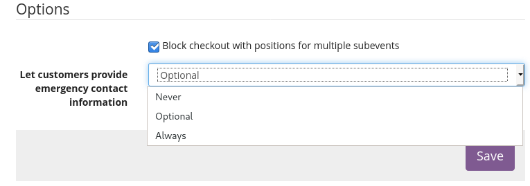
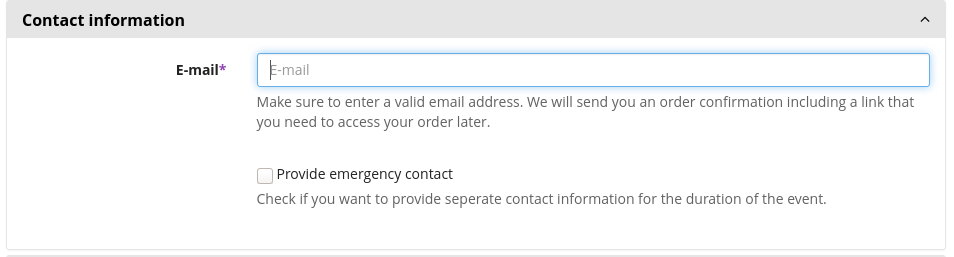
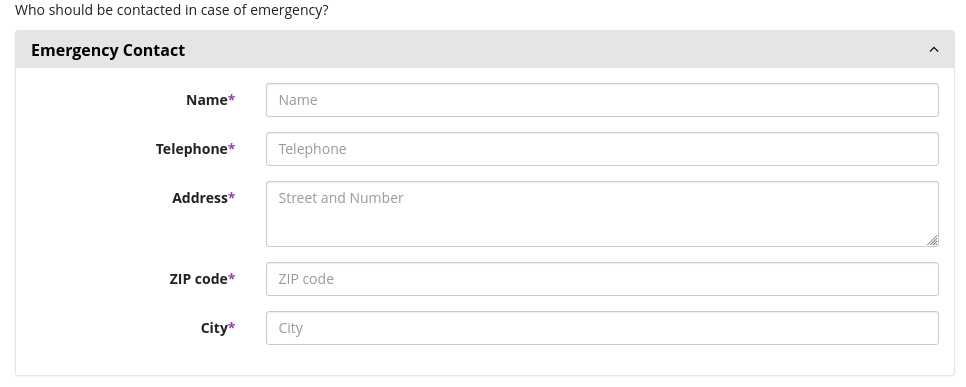
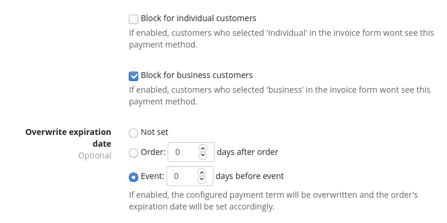

Pretix Purple Tweaks
====================

This is a plugin for `pretix`_ that has various features that can be turned on/off. 

This is code made public from a private plugin I once used at a non profit. I don't recomment to use it in production as is, but it might be good to build your own solutions from it.

Features
--------

If enabled in the settings, ror events with subevents, checkout can only be started with a cart that only contains products from a single subevent.



If enabled in the settings, customers must provide information for emergency contact similar to the invoice address. It can also be made optional.
The information is shown in the detail view of the order in front- and backend as well as in ticket layout variables.




Two Payment Providers "Purple Manual Payment" and "Purple Cash Payment" are added.
For these special settings can be configured additionally to their non-purple counterparts:
   - Payment due date can be configured per payment provider as a relative date before the event or after the order placement.
   - Payment method can be made available based on wether the customer chose `individual` or `business` customer as per the invoice address form.



The payment providers are hardcoded, one should **install** the plugin `pretix-cashpayment` as a dependency.

Development setup
-----------------

1. Make sure that you have a working `pretix development setup`_.

2. Clone this repository, eg to ``local/pretix-purpletweaks```.

3. Activate the virtual environment you use for pretix development.

4. Execute ``python setup.py develop`` within this directory to register this application with pretix's plugin registry.

5. Execute ``make`` within this directory to compile translations.

6. Restart your local pretix server. You can now use the plugin from this repository for your events by enabling it in
   the 'plugins' tab in the settings.


License
-------

Copyright 2019 Felix Rindt

Released under the terms of the Apache License 2.0


.. _pretix: https://github.com/pretix/pretix
.. _pretix development setup: https://docs.pretix.eu/en/latest/development/setup.html
